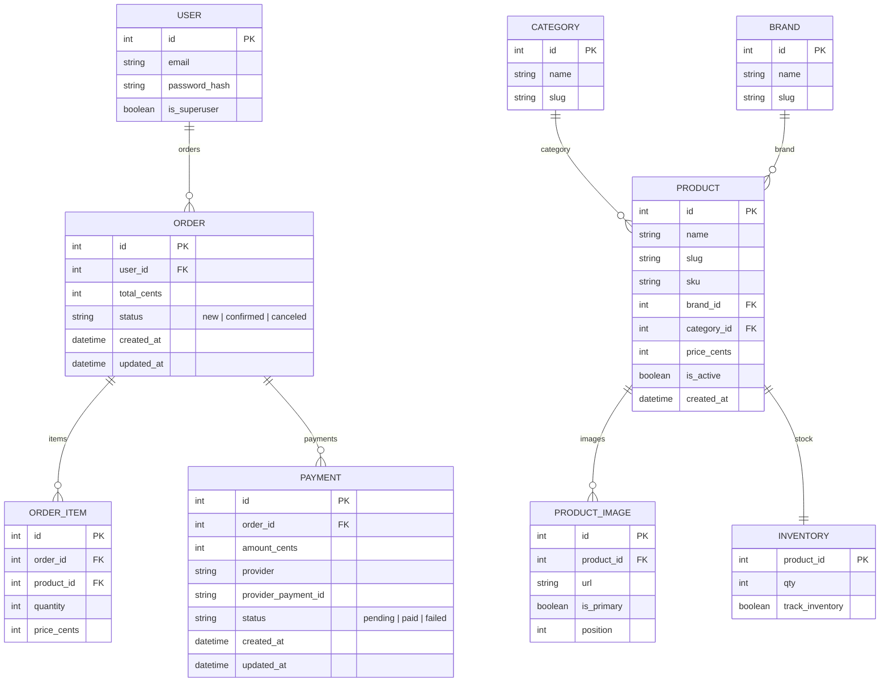

# 🛍️ E-commerce Core API (FastAPI) — v0.1.0

* [](https://github.com/Mr-Shams86/E-commerce_Core_API/actions/workflows/ci.yml)


* A minimal yet production-ready e-commerce API core: JWT-based authentication, product catalog (categories, brands, items), image handling, inventory management, public listings with filtering and sorting, and Redis-powered caching.
* Fully containerized with Docker.

---

## ⭐ Why this project matters

This project demonstrates how to build a **compact, modular, and extensible e-commerce backend core**, optimized for real-world production workloads.

It showcases:

- REST API architecture with **FastAPI**
- Database models and migrations with **SQLAlchemy + Alembic**
- **Redis** caching for product listings, with cache invalidation
- Admin **CRUD** for the product catalog
- Clean and maintainable project structure
- API testing with **Pytest**
- **CI/CD** with **Ruff** + **GitHub Actions**
- Fully containerized setup using **Docker / docker-compose**

The core can be easily extended into a full e-commerce backend with orders, payments, recommendations, and dedicated microservices.

---

## 🧱 Architecture Overview

High-level components:

- **FastAPI** – main web service
- **PostgreSQL** – relational database (users, categories, brands, products, inventory, images)
- **Redis** – caching layer for product listings
- **JWT** – authentication (login/register)
- **Docker Compose** – orchestrates API, Postgres, Redis
- **GitHub Actions** – CI pipeline (lint + tests)
- **Pytest** – test suite for API endpoints

---

## 📘 ER Diagram (Mermaid)

GitHub renders Mermaid diagrams natively.



## ⚙️ Stack
- **FastAPI** + **Uvicorn**
- **SQLAlchemy** + **Alembic** (PostgreSQL)
- **Redis** — Caching of public listings
- **PyJWT (python-jose)** + **passlib** — JWT + bcrypt
- **Docker / docker-compose**
- **Ruff**, **pre-commit**, **GitHub Actions** — Auto linting & CI


## 📂 Project Structure

```bash
.
├── alembic
│   ├── env.py
│   ├── README
│   ├── script.py.mako
│   └── versions
│       ├── 1575d40ca19b_add_orders_tables.py
│       ├── 98848a648c3a_initial_schema_users_catalog_product_.py
│       └── c1edb345f74c_add_payments_table.py
├── alembic.ini
├── app
│   ├── api
│   │   ├── deps.py
│   │   ├── __init__.py
│   │   ├── routers
│   │   │   ├── admin_catalog.py
│   │   │   ├── auth.py
│   │   │   ├── health.py
│   │   │   ├── __init__.py
│   │   │   ├── orders.py
│   │   │   ├── products.py
│   │   │   └── users.py
│   │   └── services
│   │       ├── __init__.py
│   │       ├── orders.py
│   │       └── payments.py
│   ├── core
│   │   ├── cache.py
│   │   ├── config.py
│   │   └── security.py
│   ├── db.py
│   ├── __init__.py
│   ├── main.py
│   ├── models
│   │   ├── catalog.py
│   │   ├── __init__.py
│   │   ├── order.py
│   │   ├── payment.py
│   │   └── user.py
│   └── schemas
│       ├── catalog.py
│       ├── __init__.py
│       ├── order.py
│       ├── payment.py
│       └── user.py
├── commands.txt
├── dev-requirements.txt
├── docker
│   └── api.Dockerfile
├── docker-compose.override.yml
├── docker-compose.yml
├── Makefile
├── pyproject.toml
├── pytest.ini
├── README.md
├── requirements.txt
├── scripts
│   └── seed_demo_data.py
├── structure.txt
└── tests
    ├── api
    │   ├── test_admin_media_inventory.py
    │   ├── test_auth.py
    │   ├── test_products_detail.py
    │   └── test_products.py
    └── conftest.py


```

## 🚀 Quick start

```bash
# 1) .env (see below) — create from the example if needed
cp .env.example .env

# 2) Run
docker compose up --build

# 3) (optional) demo data
docker compose exec api python scripts/seed_demo_data.py
```

## Access:

* 🌐 API: http://localhost:8000
* 📘 Swagger: http://localhost:8000/docs
* ❤️ Health: http://localhost:8000/healthz


## 🌍 Environment variables

Example `.env`:

```env
# FastAPI
APP_ENV=dev
APP_HOST=0.0.0.0
APP_PORT=8000

# PostgreSQL
POSTGRES_DB=ecom
POSTGRES_USER=ecom
POSTGRES_PASSWORD=ecom
POSTGRES_HOST=db
POSTGRES_PORT=5432
DATABASE_URL=postgresql+psycopg://ecom:ecom@db:5432/ecom

# Redis
REDIS_URL=redis://redis:6379/0

# JWT
SECRET_KEY=change_me_long_random
JWT_ALGORITHM=HS256
ACCESS_TOKEN_EXPIRE_MINUTES=1440

# UID / GID (for correct container permissions)
UID=1000
GID=1000
```

> `Set UID/GID to match your user (id -u / id -g)`.
> `The api service in docker-compose.yml runs with user: "${UID}:${GID}"`.


## 🧱 Migrations (Alembic)

```bash
# create a migration from current models
docker compose exec api alembic revision -m "my change" --autogenerate

# apply all migrations
docker compose exec api alembic upgrade head

# history / current revision
docker compose exec api alembic history
docker compose exec api alembic current

```

## Clean DB start

```bash
docker compose down
docker volume rm e-commerce_core_api_pgdata
docker compose up --build
```

## 🔐 Authentication (JWT)
1. **Register**: `POST /auth/register` — creates a user (`is_superuser=false`).
2. **Login**: `POST /auth/login` (`application/x-www-form-urlencoded`) → `{"access_token": "...", "token_type": "bearer"}`.
3. In Swagger click **Authorize** and paste `Bearer <access_token>`.
4. **Check**: `GET /users/me`.


## 🧑‍💼 Superuser
* Admin catalog endpoints require is_superuser=true.
* In dev you can mark a user manually:

```bash
docker compose exec -T db sh -lc \
'psql -U "$POSTGRES_USER" -d "$POSTGRES_DB" -c "UPDATE users SET is_superuser = true WHERE email = '\''you@example.com'\'';"'
```

## Catalog (admin, superuser only)
* **Categories**
  * `POST /admin/categories` — create
  * `PATCH /admin/categories/{cat_id}` — partial update
  * `DELETE /admin/categories/{cat_id}` — delete

* **Brands**
  * `POST /admin/brands`
  * `PATCH /admin/brands/{brand_id}`
  * `DELETE /admin/brands/{brand_id}`

* **Products**
  * `POST /admin/products`
  * `PATCH /admin/products/{prod_id}`
  * `DELETE /admin/products/{prod_id}`

* **Product images**
  * `POST /admin/products/{prod_id}/images` — add image URL (supports is_primary, position)

* **Inventory**
  * `PATCH /admin/products/{prod_id}/inventory?qty=5&track_inventory=true` — inventory upsert

## ⚠️ sku and slug are unique.
* brand_id and category_id must reference existing records.

**PATCH hints**

* Only send fields that should be changed.
`brand_id`/`category_id` — must reference existing records.
`sku` and `slug` — must be unique.

## 🧾 Orders (Order Creation)

* **Create an order**
 * POST /orders

**Payload**:
```json
  {
    "items": [
      {"product_id": 1, "quantity": 2},
      {"product_id": 5, "quantity": 1}
    ]
  }
  ```

* The API automatically:

* validates that products exist

* checks inventory stock

* deducts inventory quantities

* captures a price snapshot per product

* calculates the final total_cents

* creates an Order + OrderItems

**Response**:
```json
  {
    "id": 10,
    "status": "new",
    "total_cents": 150000,
    "created_at": "...",
    "items": [
      {"id": 1, "product_id": 1, "quantity": 2, "price_cents": 50000},
      {"id": 2, "product_id": 5, "quantity": 1, "price_cents": 50000}
    ]
  }
  ```


## 📜 My Orders

 `GET /orders/me`
* Returns all orders of the authenticated user (sorted from newest to oldest).


## 💳 Payments (Order Payment)

* Payment endpoint:
 `POST /orders/{order_id}/pay`

* This uses a fake but logically correct payment provider:

* creates a Payment record

* generates provider_payment_id = test-uuid4

* marks payment as paid

* updates the order status to confirmed

**Response example**:
```json
  {
    "id": 1,
    "order_id": 10,
    "amount_cents": 150000,
    "provider": "test",
    "provider_payment_id": "test-551ba1ba-...",
    "status": "paid",
    "created_at": "..."
  }
  ```

* Validation rules:

* you cannot pay someone else’s order

* you cannot pay an order whose status is not new

* you cannot pay twice

* you cannot pay an order where total_cents = 0


## 🛒 Public product listing
`GET /products` — filters:
* q — search by name / slug
* category_id — filter by category
* brand_id — filter by brand
* sort: price_asc, price_desc, created_desc (default), created_asc
* limit — pagination (default 20, max 100), offset (default 0)

**Response** (pagination):
```json
{
  "total": 123,
  "limit": 20,
  "offset": 0,
  "items": [ { ...ProductRead }, ... ]
}
```

`GET /products/{prod_id}` — product details

**Response**
```json
* {
  "id": 1,
  "sku": "SKU-1",
  "name": "Phone 1",
  "slug": "phone-1",
  "brand_id": 1,
  "category_id": 1,
  "price_cents": 100000,
  "is_active": true,
  "created_at": "2025-10-15T10:34:28.128Z",
  "images": [
    {"id": 10, "url": "https://picsum.photos/seed/1/600/400", "is_primary": true, "position": 0}
  ],
  "inventory_qty": 5,
  "in_stock": true
}
```


## 🔁 Caching (Redis)
* /products listing is cached for 120 seconds (the key includes filters/sort/pagination)
* Any admin operation on categories, brands, products, images or inventory invalidates `products:*` keys.


## 🧪 Request examples

```bash
# Register
curl -X POST http://localhost:8000/auth/register \
  -H "Content-Type: application/json" \
  -d '{"email":"demo@example.com","password":"x123456"}'

# Login
TOKEN=$(curl -s -X POST http://localhost:8000/auth/login \
  -H "Content-Type: application/x-www-form-urlencoded" \
  -d 'username=demo@example.com&password=x123456' | jq -r .access_token)

# Create a brand
curl -X POST http://localhost:8000/admin/brands \
  -H "Authorization: Bearer $TOKEN" \
  -H "Content-Type: application/json" \
  -d '{"name":"XBrand","slug":"xbrand"}'
```


## Useful commands

```bash
# API logs
docker compose logs -f api

# Shell inside API container
docker compose exec api bash

# Tables in Postgres
docker compose exec -T db sh -lc \
'psql -U "$POSTGRES_USER" -d "$POSTGRES_DB" -c "\dt"'
```

## 🧠 Development & tests

* Hot-reload is enabled (volumes for app/ and alembic/ are mounted).
* Pre-commit: Ruff formats/lints on commit.

## Tests & CI

* Locally:

```bash
docker compose exec -T api pytest -q
```

CI (GitHub Actions, .github/workflows/ci.yml):
* `ruff check .`
* `ruff format --check .`
* `pytest .`


## 🚑 Troubleshooting
* **403 Forbidden on /admin/**: current user is not is_superuser=true
* **409 Conflict on product create/update**: sku or slug conflict
* **500 Internal Server Error on PATCH/POST**:
  * non-existing brand_id / category_id
  * unique constraint violation
* Swagger /docs is not opening:
  * check docker compose ps (api must listen on 0.0.0.0:8000)
  * make sure port 8000 is free


## 🧭 Roadmap (future ideas)

The core already includes:

- ✔ Full product catalog (categories, brands, products, images)
- ✔ Inventory management
- ✔ Public product listing with Redis caching
- ✔ Orders + OrderItems
- ✔ Payments subsystem (fake provider for demo)
- ✔ Authentication & superuser admin flows

Upcoming improvements:

- [ ] Asynchronous background tasks (email notifications, stock sync)
- [ ] Payment integration (Stripe / PayPal sandbox)
- [ ] Admin dashboard (React / Next.js)
- [ ] Product recommendations (simple scoring / Redis-based)
- [ ] Upload API for real images (S3 / MinIO)
- [ ] Webhooks for events (product.created, order.created, etc.)
- [ ] Microservice extraction (catalog, orders, payments)


## 🧑‍💻 Author: ๛Samer Shams๖
## 📦 Repository: https://github.com/Mr-Shams86/E-commerce_Core_API
